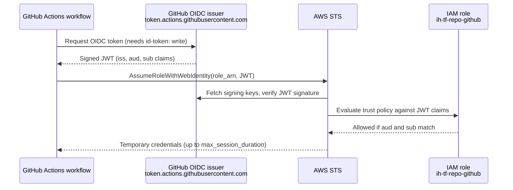

# Architecture

## What the Module Creates

| Address | Type | Purpose |
|---------|------|---------|
| `aws_iam_role.github` | resource | The role a GitHub Actions workflow assumes |
| `data.aws_iam_openid_connect_provider.github` | data source | Looks up the account's GitHub OIDC provider |
| `data.aws_iam_policy_document.github-trust` | data source | Builds the trust policy attached to the role |

That is the whole module. It intentionally creates no permission policies, no identity provider, and no
GitHub-side resources.

## How Keyless Authentication Works



Nothing static is exchanged: the JWT is minted per job, lives for minutes, and is only accepted by AWS
because the account trusts the GitHub issuer and the role's trust policy matches the token's claims.

## The Trust Policy

The module renders a trust policy equivalent to this JSON:

```json
{
  "Version": "2012-10-17",
  "Statement": [
    {
      "Effect": "Allow",
      "Action": "sts:AssumeRoleWithWebIdentity",
      "Principal": {
        "Federated": "arn:aws:iam::123456789012:oidc-provider/token.actions.githubusercontent.com"
      },
      "Condition": {
        "StringEquals": {
          "token.actions.githubusercontent.com:aud": "sts.amazonaws.com"
        },
        "StringLike": {
          "token.actions.githubusercontent.com:sub": [
            "repo:infrahouse/aws-control:*",
            "repo:infrahouse@*/aws-control@*:*"
          ]
        }
      }
    }
  ]
}
```

Three things must line up for the assume-role call to succeed:

1. **Federated principal** — the ARN of the account's GitHub OIDC provider. The module reads it from
   `data.aws_iam_openid_connect_provider.github` using the URL
   `https://token.actions.githubusercontent.com`, so the provider must already exist.
2. **`aud` claim** — `sts.amazonaws.com`, the audience
   [`aws-actions/configure-aws-credentials`](https://github.com/aws-actions/configure-aws-credentials)
   requests by default.
3. **`sub` claim** — identifies the workflow. The module matches any workflow of the given repository,
   regardless of branch, tag, or environment (the trailing `:*`).

## Subject Claim Formats

GitHub is migrating to *immutable* subject claims that embed numeric organization and repository IDs, so a
rename no longer silently breaks (or, worse, silently re-grants) access. New and renamed repositories get
the immutable format from 2026-07-15.

| Format | Example | Used by |
|--------|---------|---------|
| Legacy | `repo:infrahouse/aws-control:ref:refs/heads/main` | Existing repositories |
| Immutable | `repo:infrahouse@12345/aws-control@67890:ref:refs/heads/main` | New and renamed repositories |

The module allows both patterns, so the same configuration works before and after GitHub flips a repository
to the immutable format. Because the numeric IDs are matched with `@*`, the module does not need to know
them at plan time.

!!! note
    Matching `repo:<org>@*/<repo>@*:*` trusts any organization/repository ID pair whose *names* match. If a
    repository is deleted and its name later claimed elsewhere in the same organization, the new repository
    would also match. Pinning the numeric IDs requires a custom trust policy outside this module.

## Role Naming and Tags

```hcl
name = var.role_name == null ? "ih-tf-${var.repo_name}-github" : var.role_name
```

The default name (`ih-tf-<repo_name>-github`) makes roles easy to find and audit across accounts. The role
carries two provenance tags:

- `created_by_module` = `infrahouse/github-role/aws`
- `module_version` = the module version that created it

Providers commonly add more tags through `default_tags` (for example `created_by`), and those merge with the
module's tags.

## Session Duration

`max_session_duration` (default `3600` seconds) caps how long the credentials issued to the workflow remain
valid. `aws-actions/configure-aws-credentials` requests one hour by default; ask for more with its
`role-duration-seconds` input only after raising this variable to at least that value.

## Boundaries

The module does **not**:

- create the GitHub OIDC identity provider — use
  [terraform-aws-gh-identity-provider](https://github.com/infrahouse/terraform-aws-gh-identity-provider)
  once per account
- attach any permissions — see [Examples](examples.md) and [Security](security.md)
- restrict access by branch, tag, or environment — a workflow on any ref of the repository can assume the
  role
- configure anything on the GitHub side, such as repository secrets or variables
